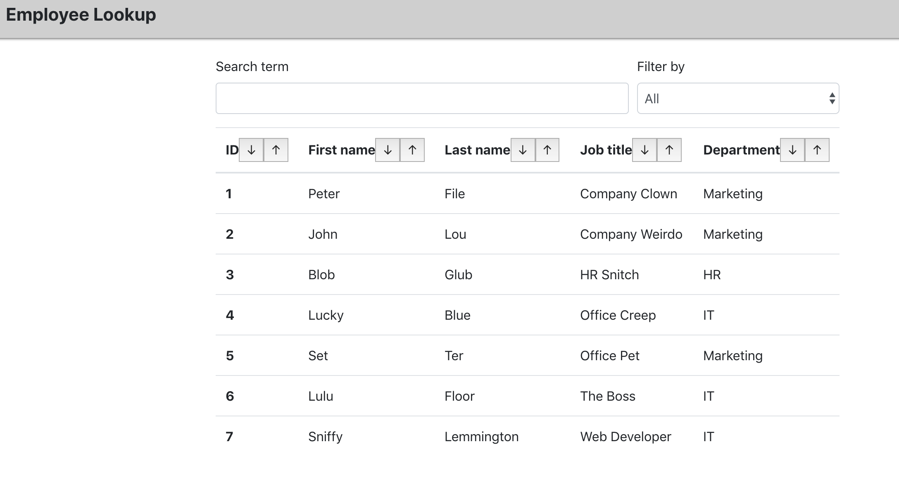
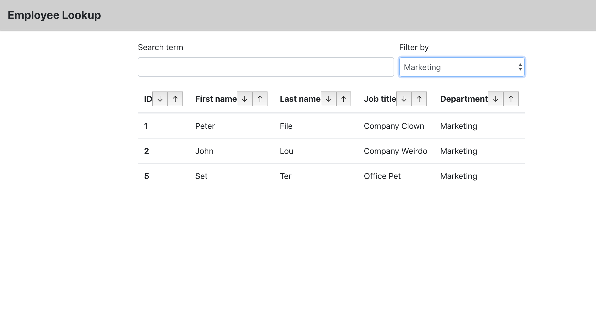
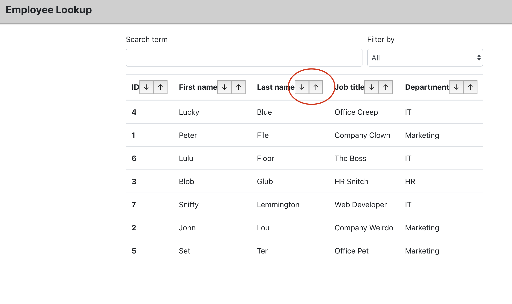

# Employee Directory in React (Reactory)

## Brief

As a user I want to be able to view my employees' non-sensitive information in a single page. I would like to filter by department and sort in ascending/descending order.

## Deployed App

Reactory can be viewed on https://reactory.herokuapp.com/ and it is a simple table with filtering/sorting buttons.

Home screen:

Filtered screen:

Sorted screen:

## Software used

Reactory is built in node.js with React, using hooks and deployed on Heroku.

## Future features

Search bar needs developing.
